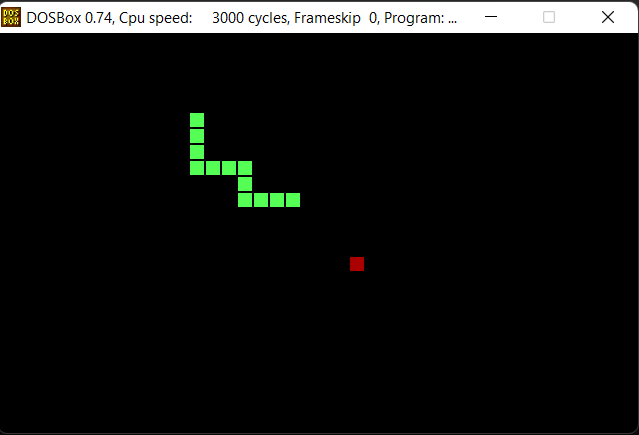

## Snake game in Assembly
This is a simple implementation of the Snake game written in assembly language.

## How to run
<ol>
    <li>Install DOSBox</li>
    <li>Create a directory with these three files: MASM.EXE, LINK.EXE, snake.asm</li>
    <li>Open your directory in DOSBox</li>
    <li>Type 'masm snake.asm;' and then 'link snake.obj;' in DOSBox terminal</li>
    <li>Run the game by typing 'snake'</li>
</ol>

## How to play
Move the snake by pressing W,A,S,D. Watch out for walls and your tail. Press ESC to quit.

    

